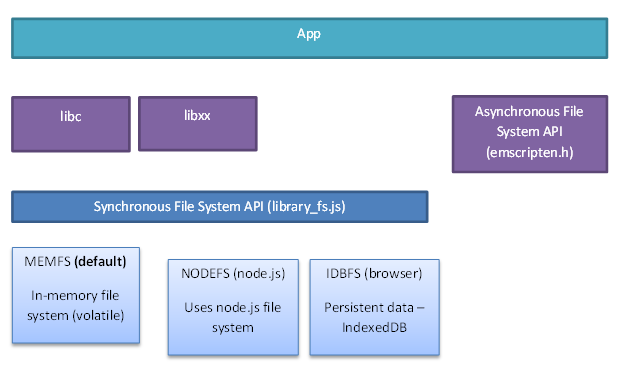

+++
title = 'Emscripten的文件系统'
date = 2021-10-21T19:58:11+08:00
+++


## Intro

我们知道Emscripten可以将C/C++代码编译到WebAssembly，从而在浏览器中运行。为了实现这个目标，除了代码层面的编译外，Emscripten还需要在Web环境下提供大量对native runtime的模拟，如文件系统、底层图形库、网络等。今天重点看一下文件系统部分。

## Overview

由于浏览器中的JavaScript无法直接访问操作系统的文件系统，Emscripten提供了一套虚拟文件系统来模拟一个POSIX FS。



如上面的架构图所示，原生代码编写的应用使用libc/libxx中API进行文件系统操作，经Emscripten编译后，调用JavaScript编写的虚拟文件系统API。

默认的虚拟文件系统实现为`MEMFS`，顾名思义它是在内存里实现的，页面刷新后数据就会丢失。如果需要持久化，在浏览器里可以使用基于IndexedDB的`IDBFS`。

## 使用示例

下面我们通过一个例子来展示文件系统的使用，并为后续实验提供一个基础。

### C程序

首先我们编写一个如下含有文件操作的C程序：

```c
#include <stdio.h>

void append_line(char *filename, char *line) {
  FILE *fp = fopen(filename, "a");
  fprintf(fp, "%s\n", line);
  fclose(fp);
}

int main() {
  return 0;
}
```

这段程序中定义了 `append_line` 函数，它的作用就是往一个文件里添加一行新内容。我们在`main`中并没有调用它，而是准备暴露给JS代码调用。

### 编译

接下来我们用下面的命令编译这段C代码到WebAssembly，在选项中指定export `append_line` 函数。

```bash
emcc fs.c \
  -o fs.js \
	-s EXPORTED_RUNTIME_METHODS="[cwrap, FS]" \
	-s EXPORTED_FUNCTIONS="[_append_line]"
```

编译后会得到 `fs.js` 和 `fs.wasm` 两个文件，其中 `fs.js` 是 Emscripten提供的 wrapper 文件，它会自动处理 wasm 文件的加载等等。我们写一段极其简单的HTML来使用它：

```html
<body>
	<script src="fs.js"></script>
	<script>
		const appendLine = Module.cwrap('append_line', null, ['string', 'string'])
	</script>
</body>
```

除了引入 `fs.js` 外，我们还通过 `cwrap` 把 `append_line` 转成了可以在JS中调用的函数。（C和JS代码如何互操作不是本文的重点，想了解更多可以阅读[相关文档](https://emscripten.org/docs/porting/connecting_cpp_and_javascript/Interacting-with-code.html)。

### 使用

我们在浏览器console里做些实验：

首先执行 `appendLine('/tmp/test.txt', 'line1')` 向一个文件里写入内容。

然后我们通过[FS API](https://emscripten.org/docs/api_reference/Filesystem-API.html#id2) 把内容读出来看看：

```jsx
> Module.FS.readFile('/tmp/test.txt', { encoding: 'utf8' })
"line1\n"
```

成功！

## Emscripten文件系统的实现

对概念和使用有了基本认识后，我们来看看Emscripten文件系统的实现。

### WebAssembly调用JavaScript代码

在前文架构图处提到，Emscripten的文件系统是在JavaScript层面实现的，然后由C/C++调用。更准确地说，是由C/C++编译后的WebAssembly调用。

我们以文本格式打开编译出的 `fs.wasm`，可以在头部看到一些 import 语句：

```wasm
(import "env" "__sys_open" (func $env.__sys_open (type $t1)))
(import "wasi_snapshot_preview1" "fd_close" (func $wasi_snapshot_preview1.fd_close (type $t0)))
(import "env" "__sys_fcntl64" (func $env.__sys_fcntl64 (type $t1)))
(import "env" "__sys_ioctl" (func $env.__sys_ioctl (type $t1)))
(import "wasi_snapshot_preview1" "fd_write" (func $wasi_snapshot_preview1.fd_write (type $t9)))
(import "wasi_snapshot_preview1" "fd_read" (func $wasi_snapshot_preview1.fd_read (type $t9)))
(import "env" "__sys_mkdir" (func $env.__sys_mkdir (type $t2)))
(import "env" "emscripten_resize_heap" (func $env.emscripten_resize_heap (type $t0)))
(import "env" "emscripten_memcpy_big" (func $env.emscripten_memcpy_big (type $t1)))
(import "env" "setTempRet0" (func $env.setTempRet0 (type $t4)))
(import "wasi_snapshot_preview1" "fd_seek" (func $wasi_snapshot_preview1.fd_seek (type $t7)))
...
```

不难看出，其中的 `fd_read`, `fd_write` 等是与文件操作相关的。它们的实现又在哪里呢？

要在WebAssembly中调用JavaScript代码，需要在实例化WebAssembly时传入一个 `importObject`。下面就是 `fs.js`中实例化的地方：

```jsx
return fetch(wasmBinaryFile, { credentials: 'same-origin' }).then(function (response) {
  var result = WebAssembly.instantiateStreaming(response, info);
  ...
})
```

其中 `info` 就包含了要被导入到WebAssembly实例的对象，它的定义也在 `fs.js` 里：

```jsx
var asmLibraryArg = {
  "__sys_fcntl64": ___sys_fcntl64,
  "__sys_ioctl": ___sys_ioctl,
  "__sys_open": ___sys_open,
  "emscripten_memcpy_big": _emscripten_memcpy_big,
  "emscripten_resize_heap": _emscripten_resize_heap,
  "fd_close": _fd_close,
  "fd_read": _fd_read,
  "fd_seek": _fd_seek,
  "fd_write": _fd_write,
  "setTempRet0": _setTempRet0
};

var info = {
  'env': asmLibraryArg,
  'wasi_snapshot_preview1': asmLibraryArg,
};
```

可以看到这里的定义和 `fs.wasm` 中的 `import` 是一一对应的。

搞懂了Emscripten编译出的WebAssembly如何调用JavaScript代码后，我们可以去看看具体的实现了。

### JavaScript实现

Emscripten虚拟文件系统的实现位于源码的 `src` 目录下，主体是 [`library_fs.js`](https://github.com/emscripten-core/emscripten/blob/main/src/library_fs.js)，各个具体实现分别位于 `library_memfs.js`, `library_idbfs.js` 等。

打开 `library_fs.js` 可以看到里面定义了一个大的 `FS` 对象，上面定义了各种文件操作的方法，如创建文件、删除文件、查看目录等等，比如这是 `readdir` 的代码（选择它是因为比较短）：

```jsx
readdir: function(path) {
  var lookup = FS.lookupPath(path, { follow: true });
  var node = lookup.node;
  if (!node.node_ops.readdir) {
    throw new FS.ErrnoError({{{ cDefine('ENOTDIR') }}});
  }
  return node.node_ops.readdir(node);
}
```

这里node对应的数据结构是 `FSNode`，它表示的是文件系统树中的一个节点，有这样一些重要的属性：

```jsx
FSNode {
  id         // 一个自增的数字
  parent     // 指向节点的父节点（root节点的父节点是自己）
  mode       // 节点的类型及读写模式
  name       // 文件名或目录名
	contents   // 文件内容，如果节点是目录则是目录下文件名到子节点的map
  node_ops   // 节点操作
}
```

其中 `node_ops` 的实现位于各个具体文件系统，比如我们可以在 `library_memfs.js` 里找到其 `readdir` 实现：

```jsx
readdir: function(node) {
  var entries = ['.', '..'];
  for (var key in node.contents) {
    if (!node.contents.hasOwnProperty(key)) {
      continue;
    }
    entries.push(key);
  }
  return entries;
}
```

用于Node.js环境的 `library_nodefs.js` 的实现则是基于Node.js的 `fs` 模块的：

```jsx
readdir: function(node) {
  var path = NODEFS.realPath(node);
  try {
    return fs.readdirSync(path);
  } catch (e) {
    if (!e.code) throw e;
    throw new FS.ErrnoError(NODEFS.convertNodeCode(e));
  }
}
```

就这样，`FS` 模块对外提供了统一的文件操作接口，且可以方便的切换到不同的底层实现。

现在我们回头看看前面提到的传给WebAssembly实例的`asmLibraryArg`，里面并没有直接使用FS模块的方法，而是出现了一个叫 `_fd_write` 的函数，它定义在 [library_wasi.js](https://github.com/emscripten-core/emscripten/blob/cecc2feb007726dfacc0dc86e8493364234be1de/src/library_wasi.js#L195) 文件里。进而会发现它又通过系统调用 `SYSCALLS.doWritev` 才最终调用了 `FS.write`。

限于篇幅，关于 [WASI](https://wasi.dev/) 和 Emscripten 中对系统调用的实现这里就不作展开了。